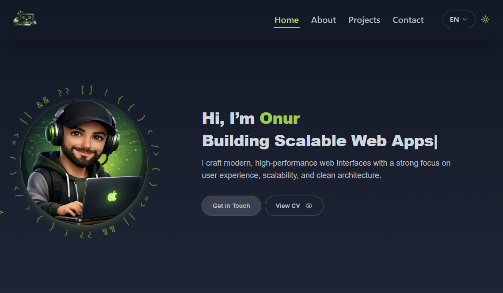
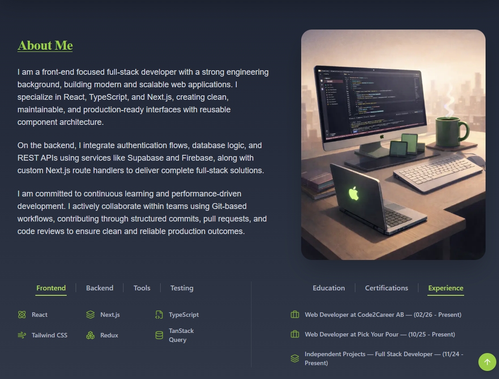
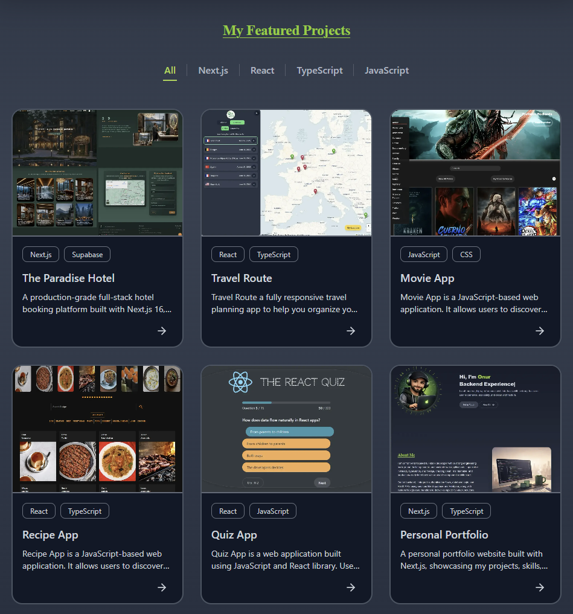
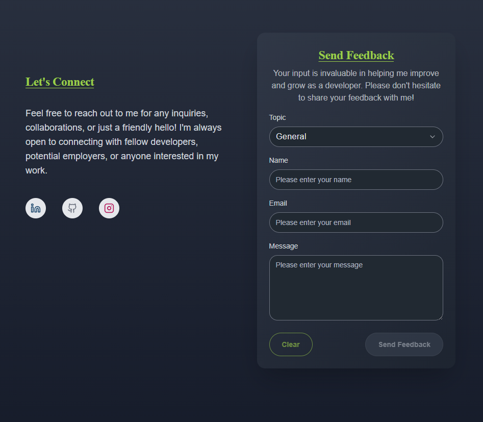
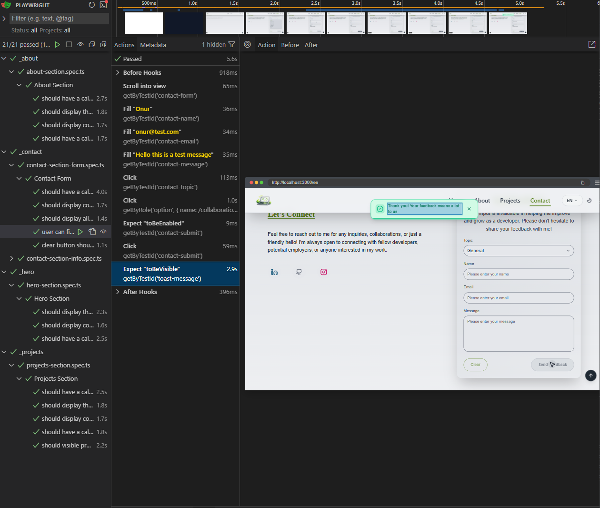
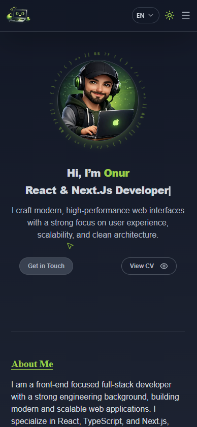
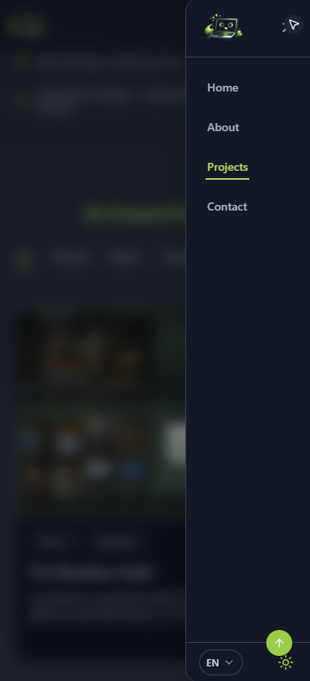

# 🏨 Personal Portfolio Proejct


---

## 🚀 Project Summary

A modern, fully animated developer portfolio built with Next.js, React 19, TypeScript, and Tailwind CSS.

The project focuses on performance, accessibility, smooth UI animations, and clean architecture while showcasing projects, expertise, and developer experience.

🌐 **Live Demo:** https://onuryemez-dev.vercel.app

---

## ✨ Features

⚡ Next.js App Router
🎨 Tailwind CSS responsive UI
☀️ Dark / Light theme with persistent state  
🎬 Fully Animated UI
🌍 Internationalization (i18n) with next-intl
🧩 Reusable UI components
📱 Fully responsive layout
📄 Downloadable Resources
🧠 Dynamic project modal system
📬 Contact form with email delivery (Resend)
🔔 Toast notification system for user feedback
🧪 End-to-End testing with Playwright
🔁 Automated CI pipeline with GitHub Actions
🚀 Optimized for Vercel deployment

---

## 📸 Screenshots & UI Preview

### 🏠 Hero



---

### 🏨 About



---

### 🏨 Projects



---

### 📅 Contact



---

### 🧪 Playwright Testing



---

## 📱 Responsive Mobile Experience

|              Mobile View 1              |              Mobile View 2              |
| :-------------------------------------: | :-------------------------------------: |
|  |  |

---

## ✨ Features Sections

### 🖼️ Hero Section

-The entire interface is built with smooth and modern animations using Framer Motion.
-Navigation is powered by section IDs and scroll tracking.

-Users can easily access:
.Developer CV
.Certificates
.Additional professional information

-All accessible through quick navigation links.

---

### 🖼️ About Section

-Personal developer introduction
-Technical background
-Tech stack overview
-Expertise and certifications

---

### 🖼️ Projects Section

-Filtering projects based on technology.
-Preview image
-GitHub repository link
-Live demo link (if available)
-Detailed project modal
-Smooth scroll-triggered animations
-Projects appear progressively as the user scrolls down the page.

---

### 🖼️ Contact Section

-The contact section allows visitors to send messages directly from the website.

The system includes:

-Form validation with Zod
-Submission handling with React Hook Form
-Email delivery using Resend
-Spam protection via Upstash Redis
-Toast notifications for submission feedback

---

### Testing

-End-to-End tests are implemented using Playwright.

Test coverage includes:

-Navigation behavior
-Section visibility
-Project interaction
-Contact form submission
-UI rendering checks

### Continuous Integration

-CI pipeline is configured using GitHub Actions.

Every push triggers:

-Dependency installation
-Project build
-Playwright test execution
-If any test fails, the pipeline fails.

### 🧱 Core Dependencies

Key libraries used in the project:

-Next.js 16
-React 19
-TypeScript
-Tailwind CSS
-Framer Motion
-React Hook Form
-Zod
-Resend
-Upstash Redis
-next-intl
-Playwright

---

## ▶️ Running Tests

This project includes end-to-end tests.

### 🎭 End-to-End Tests (Playwright)

```bash
npm run test:e2e

npm run test:e2e:ui

npm run test:e2e:headed
```

### 🔐 Environment Variables

This project relies on environment variables for authentication, database access, and email services.

Create `.env` files based on `.env.example`:

> Environment variables are required to configure external services such as Resend and Redis.

## ⚡ Getting Started

```bash
### Prerequisites

- Node.js (v18+ recommended)
- npm or yarn

### Installation


git clone https://github.com/Onuryemez54/My-Portfolio-Website.git


# Install dependencies
npm install
# or
yarn install


## Running the Project

# Start development server (Vite)
npm run dev
```

📬 **Contact**

Created by **Onur Ahmet Yemez**
Full-Stack Developer

🔗 GitHub: https://github.com/Onuryemez54

Feel free to reach out for collaboration, feedback, or questions.
